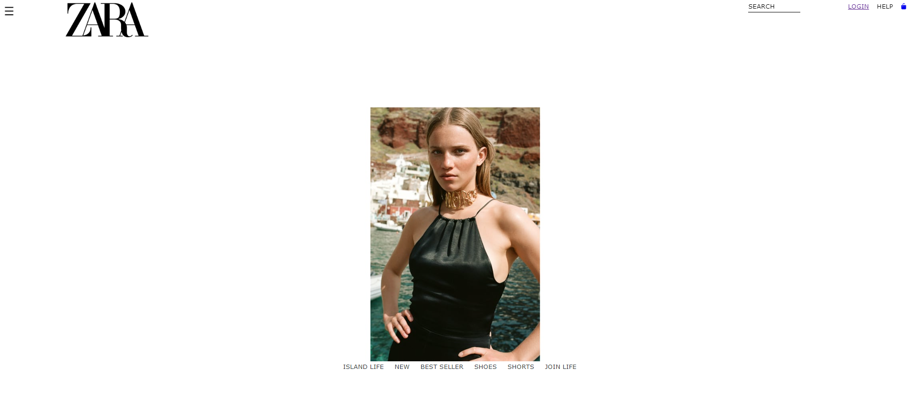
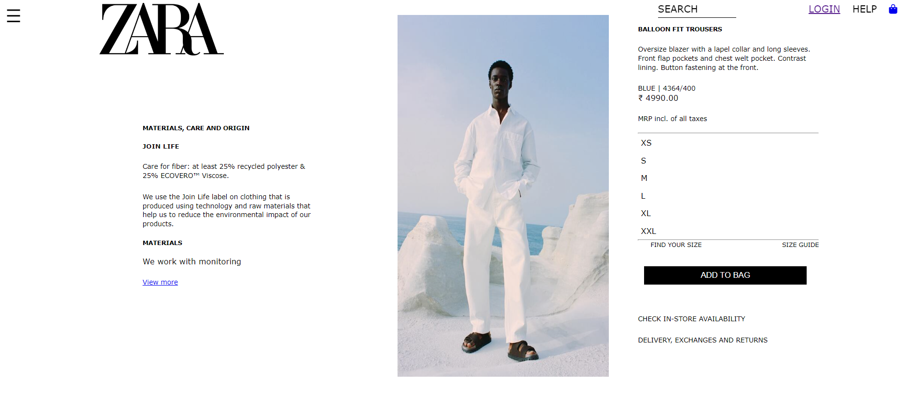

This is a solo Project from Masai School in the Construct Week by FW-17 batch students.

info : Zara is a Spanish clothing retailer based in Galicia, Spain. Founded by Amancio Ortega in 1975, it is the flagship chain store of the Inditex group, the world's largest apparel retailer. The fashion group also owns brands such as Pull&Bear, Massimo Dutti, Bershka, Stradivarius, Oysho, Zara Home and Uterqüe.

Challenges : During the project,  I got too many challenges to develope the all pages. we faced many challenges about HTML, CSS and JavaScript. but I practiced, revised and learn and apply the method of make a good clone.

###  Tech Stack & Tools : HTML , CSS , JAVASCRIPT, GIT

Deployed link :- https://eloquent-semolina-66e2d9.netlify.app/

gitHub Repo : - https://github.com/pankajsajwan12/zara-clone

